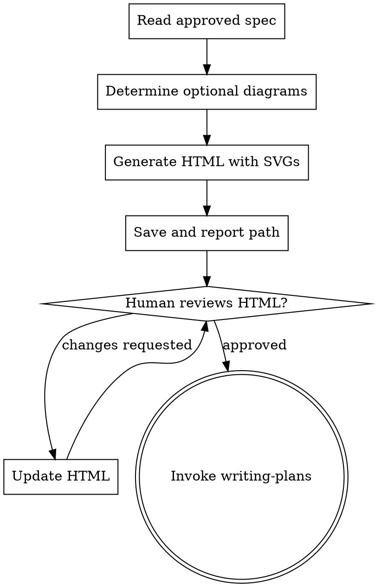

# Writing HTML Design Doc

## Overview

Generate a self-contained HTML design document with inline SVG diagrams from the approved spec. The document gives human reviewers a visual, browser-openable artifact to understand and approve before implementation begins.

**Announce at start:** "I'm using the `writing-html-design-doc` skill to create the visual design document."

**Save to:** `docs/superpowers/designs/YYYY-MM-DD-<feature-name>-design.html`

## Process



1. Read the approved spec from `docs/superpowers/specs/` (the file written by `brainstorming`)
2. Synthesize from spec + conversation context: goal, components, data structures, interactions, key decisions
3. Determine which conditional diagrams apply (see Diagram Rules)
4. Generate the HTML file with all applicable sections and SVGs
5. Save and tell the user: *"Design document written to `<path>`. Please open it in a browser and review it."*
6. Wait for explicit human approval. If changes requested, update the HTML (targeted update to changed sections only) and re-present
7. Once approved, invoke `superpowers:writing-plans`

## HTML Structure

Single self-contained `.html` file — no CDN, no external assets. Opens offline in any browser.

### Always-Present Sections

| Section | Content |
|---|---|
| Header | Feature name, date, "Awaiting Review" status badge |
| Overview | Goal (1–2 sentences), tech stack table, key constraints |
| Architecture | Inline SVG — components as labeled boxes, dependency arrows. Always generated. |
| Key Decisions | Table: decision, chosen option, alternatives considered, reason |
| Components | 1–3 sentence description per major component |

### Conditional Sections

| Diagram | Include when | If omitted, add note |
|---|---|---|
| Data Flow | System moves or transforms data between components | *"No distinct data transformation layer — data flow omitted."* |
| Sequence | Meaningful multi-step interactions exist (user actions, API calls, async flows) | *"No complex interaction sequences — sequence diagram omitted."* |
| Data Model | System stores or structures persistent data | *"No persistent data layer — data model omitted."* |

## SVG Diagram Guidelines

Write all SVGs using primitives only: `rect`, `text`, `line`, `path`, `marker`. No external libraries.

**Color palette:**
- Component boxes: `fill="#dbeafe" stroke="#3b82f6"` (blue)
- Relationship lines/arrows: `stroke="#6b7280"` (grey)
- Labels: `fill="#111827"` (near-black)
- SVG background: `fill="#f9fafb"` (light grey)

**Minimum SVG size:** `width="800"`, scale height to content. Each diagram has a visible `<p class="caption">` below it.

**Architecture:** Left-to-right or top-to-bottom. Each component is a `rect` (min 120×50px) with centered `text`. Arrows use `line` with arrowhead `marker`. Include `<title>` element for accessibility.

**Data Flow:** Left-to-right. Inputs on left, outputs on right, transforms in center. Use `rx="8"` on transform rects.

**Sequence:** Vertical dashed lifelines, horizontal message arrows with labels above. Actor/component names at top of each lifeline.

**Data Model:** Entity `rect` with a filled header bar and field rows below. Relationship lines connect entities with cardinality labels (1, *, 1..*).

## HTML Template

Use this as the base. Fill in all bracketed placeholders with real content from the spec and conversation.

```html
<!DOCTYPE html>
<html lang="en">
<head>
  <meta charset="UTF-8">
  <meta name="viewport" content="width=device-width, initial-scale=1.0">
  <title>[Feature Name] Design Document</title>
  <style>
    body { font-family: system-ui, sans-serif; max-width: 1100px; margin: 0 auto; padding: 2rem; color: #111827; background: #fff; }
    h1 { font-size: 1.8rem; margin-bottom: 0.25rem; }
    .badge { display: inline-block; padding: 0.2rem 0.7rem; border-radius: 9999px; font-size: 0.75rem; font-weight: 600; background: #fef3c7; color: #92400e; border: 1px solid #fcd34d; }
    .meta { color: #6b7280; font-size: 0.875rem; margin-bottom: 2rem; }
    h2 { font-size: 1.3rem; border-bottom: 2px solid #e5e7eb; padding-bottom: 0.4rem; margin-top: 2.5rem; }
    h3 { font-size: 1rem; color: #374151; margin-top: 1.5rem; }
    table { border-collapse: collapse; width: 100%; margin: 1rem 0; }
    th, td { text-align: left; padding: 0.5rem 0.75rem; border: 1px solid #e5e7eb; }
    th { background: #f9fafb; font-weight: 600; }
    .diagram-wrap { background: #f9fafb; border: 1px solid #e5e7eb; border-radius: 8px; padding: 1rem; margin: 1rem 0; overflow-x: auto; }
    .caption { font-size: 0.8rem; color: #6b7280; margin-top: 0.5rem; text-align: center; }
    .omitted { font-size: 0.875rem; color: #6b7280; font-style: italic; padding: 0.5rem 0; }
    p { line-height: 1.6; }
  </style>
</head>
<body>

<h1>[Feature Name]</h1>
<span class="badge">Awaiting Review</span>
<p class="meta">Design Document &nbsp;·&nbsp; [YYYY-MM-DD]</p>

<h2>Overview</h2>
<p>[Goal sentence(s) from spec]</p>
<table>
  <tr><th>Tech Stack</th><td>[languages, frameworks, tools]</td></tr>
  <tr><th>Constraints</th><td>[key constraints from spec]</td></tr>
</table>

<h2>Architecture</h2>
<div class="diagram-wrap">
  <svg xmlns="http://www.w3.org/2000/svg" width="800" height="300" style="background:#f9fafb">
    <defs>
      <marker id="arrow" markerWidth="10" markerHeight="7" refX="10" refY="3.5" orient="auto">
        <polygon points="0 0, 10 3.5, 0 7" fill="#6b7280"/>
      </marker>
    </defs>
    <title>System architecture diagram</title>
    <!-- replace with real components: rect + text per component, line + marker for arrows -->
  </svg>
  <p class="caption">Figure 1 — System architecture: [brief description]</p>
</div>

<!-- DATA FLOW (conditional) -->
<!-- Include if system moves/transforms data between components -->
<!-- If omitting: <p class="omitted">No distinct data transformation layer — data flow omitted.</p> -->

<!-- SEQUENCE (conditional) -->
<!-- Include if meaningful multi-step interactions exist -->
<!-- If omitting: <p class="omitted">No complex interaction sequences — sequence diagram omitted.</p> -->

<!-- DATA MODEL (conditional) -->
<!-- Include if system stores/structures persistent data -->
<!-- If omitting: <p class="omitted">No persistent data layer — data model omitted.</p> -->

<h2>Key Decisions</h2>
<table>
  <tr><th>Decision</th><th>Chosen</th><th>Alternatives</th><th>Reason</th></tr>
  <!-- one row per key decision from brainstorming conversation -->
</table>

<h2>Components</h2>
<!-- one h3 + paragraph per major component -->

</body>
</html>
```

## Review Gate

Do **not** invoke `writing-plans` until the human explicitly approves the HTML. Partial approval ("update the sequence diagram") triggers a targeted update to that section only, not a full regeneration. Re-present after each update.
